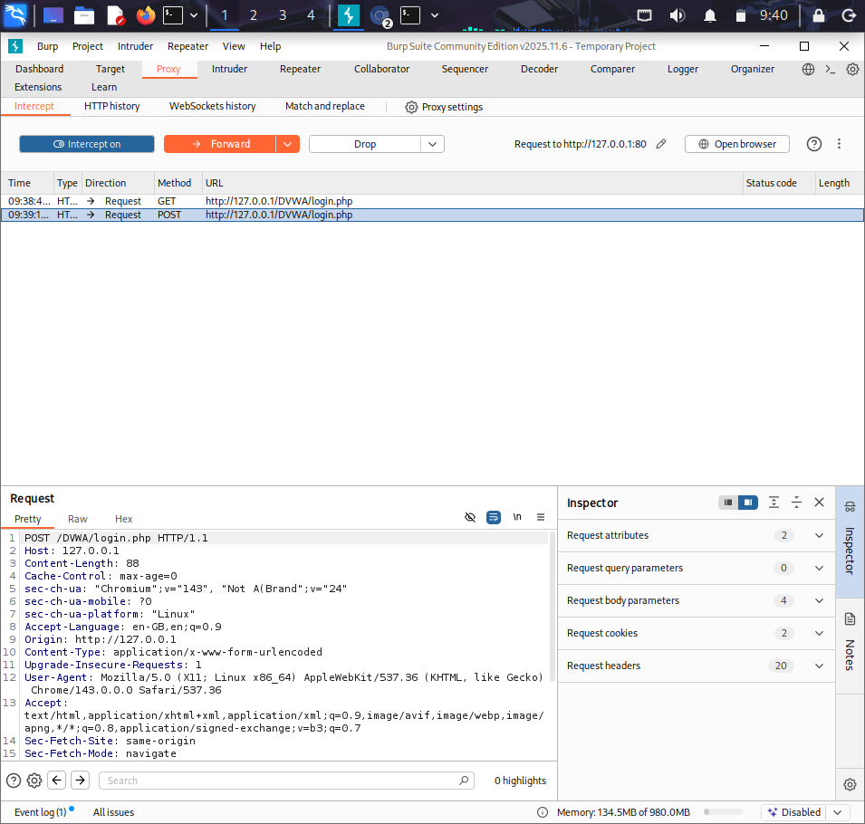
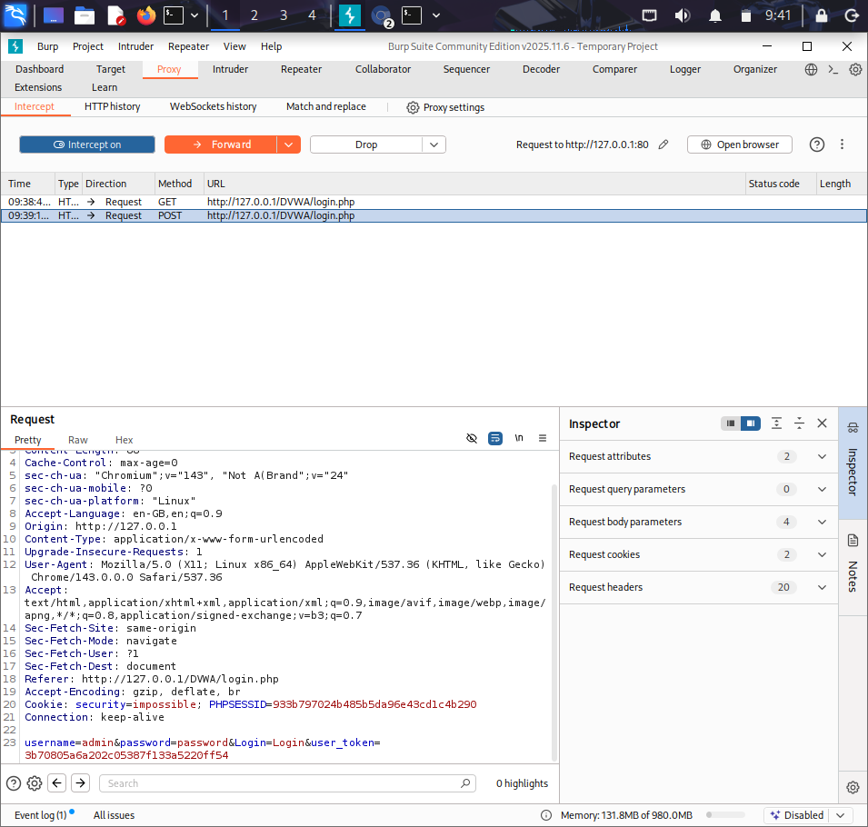
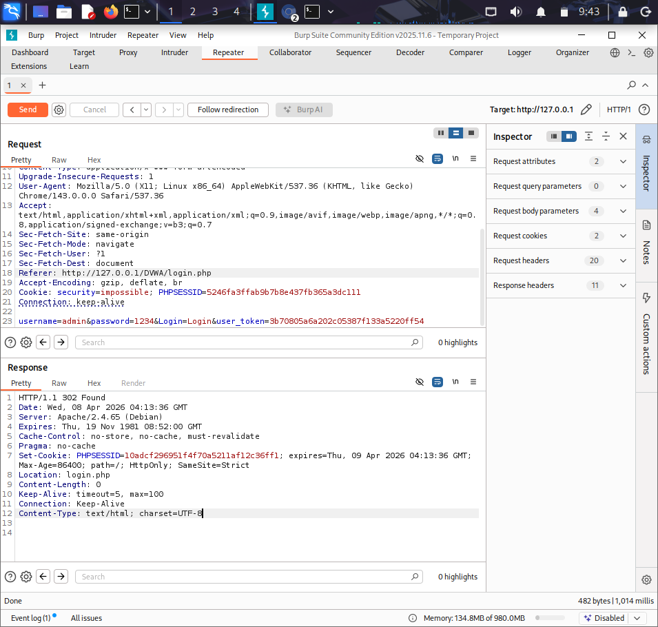

# 🛡️ Burp Suite Project 1 – Login Request Interception

## 📌 Project Overview
This project demonstrates how to intercept and analyze web login requests using Burp Suite. The goal is to understand how user credentials are transmitted and identify potential security risks.

## 🎯 Objective
- Intercept HTTP login requests
- Analyze request structure (headers, parameters)
- Identify security vulnerabilities

## 🚀 Procedure

### Step 1: Enable Intercept
- Go to Proxy tab
- Turn Intercept ON

### Step 2: Capture Login Request
- Open login page
- Enter username and password
- Click Login
- Request will be intercepted

### Step 3: Analyze Request
Example:
POST /DVWA/login.php HTTP/1.1  
Host: 127.0.0.1  
  
username=admin&password=password&Login=Login

### Step 4: Use Repeater
- Right-click request → Send to Repeater
- Modify values
- Click Send
- Observe response

## ⚠️ Security Issues
- No encryption
- Vulnerable to Man-in-the-Middle attacks
- Sensitive data exposure

## ✅ Recommendations
- Use HTTPS
- Secure authentication methods
- Encrypt sensitive data

## 📸 Screenshots

### Intercept ON

### Captured request

### Repeater testing

## 🧠 Learning Outcomes
- Learned HTTP request interception
- Understood request structure
- Practiced using Burp Suite tools

## 🚀 Conclusion
This project demonstrates basic web security testing using Burp Suite and highlights risks of insecure communication.
